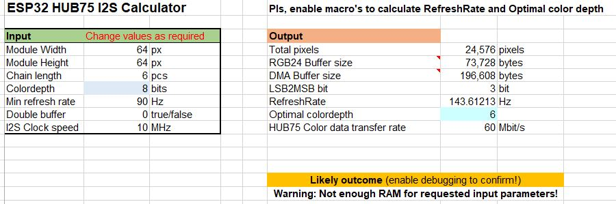
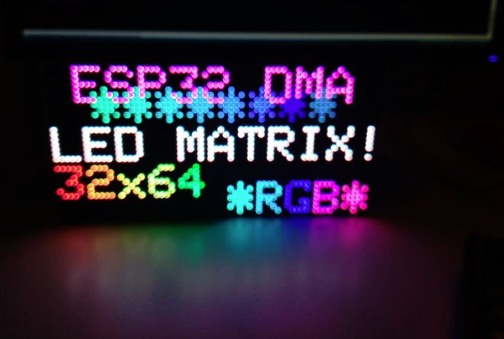

# HUB75 RGB LED matrix panel library utilizing ESP32 DMA

__[BUILD OPTIONS](/doc/BuildOptions.md) | [EXAMPLES](/examples/README.md)__ | [](https://github.com/mrfaptastic/ESP32-HUB75-MatrixPanel-DMA/actions/workflows/pio_build.yml)

**Table of Content**

- [Introduction](#introduction)
  * [Features](#features)
  * [ESP32 variants supported](#esp32-variants-supported)
  * [Required memory](#required-memory)
  * [Supported Panels](#supported-panels)
  * [Panel driver chips known to be working well](#driver-chips-known-to-be-working-well)
  * [Unsupported Panels](#unsupported-panels)
- [Getting Started](#getting-started)
  * [1. Library Installation](#1-library-installation)
  * [2. Wiring the ESP32 to an LED Matrix Panel](#2-wiring-the-esp32-to-an-led-matrix-panel)
  * [3. Run a Test Sketch](#3-run-a-test-sketch)
- [Further Information](#further-information)
  * [Can I chain panels?](#can-i-chain-panels)
  * [Can I use with a larger panel (i.e. 64x64px square panel)?](#can-i-use-with-a-larger-panel-ie-64x64px-square-panel)
  * [Adjusting Panel Brightness](#adjusting-panel-brightness)
  * [Build-time options](#build-time-options)
  * [Latch blanking](#latch-blanking)
  * [Power, Power and Power!](#power-power-and-power)
  * [Inspiration](#inspiration)
  * [Cool uses of this library](#cool-uses-of-this-library)
- [Thank you!](#thank-you)

# Introduction
* This is an ESP32 Arduino/IDF library for HUB75 / HUB75E connection based RGB LED panels. 
* This library 'out of the box' (mostly) supports HUB75 panels where simple TWO rows/lines are updated in parallel... referred to as 'two scan' panels within this documentation. 
* 'Four scan' panels are also supported - but please refer to the Four Scan Panel example sketch.
* The library uses the DMA functionality provided by the ESP32's 'LCD Mode' for fast data output.

## Features
-  **Low CPU overhead** - Pixel data is sent directly with the use of hardware-backed DMA, no CPU involvement
-  **Fast** - Updating pixel data involves only bit-wise logic over DMA buffer memory, no pins manipulation or blocking IO
-  **Full screen BCM** - Library utilizes [binary-code modulation](http://www.batsocks.co.uk/readme/art_bcm_5.htm) to render pixel color depth / brightness over the entire matrix to give reasonable colour depth
-  **Variable color depth** - Up to TrueColor 24 bits output is possible depending on matrix size/refresh rate required
-  **CIE 1931** luminance [correction](https://ledshield.wordpress.com/2012/11/13/led-brightness-to-your-eye-gamma-correction-no/) (aka natural LED dimming) implemented
-  **Adafruit GFX API** - Library can be built with AdafruitGFX, simplified GFX or without a GFX API at all

## ESP32 variants supported
* Original ESP32 - That being the ESP-WROOM-32 module with ESP32‑D0WDQ6 chip from ~2017.
* ESP32-S2; and
* ESP32-S3

RISC-V ESP32's (like the C3) are not supported as they do not have the hardware 'LCD mode' support.

## Required memory
"*What's the price for those features?*" - It's [memory](/doc/memcalc.md), you pay it all by precious MCU's internal memory (SRAM) for the DMA buffer. 

Please use the ['Memory Calculator'](/doc/memcalc.md) to see what is *typically* achievable with the typical ESP32. This is only a guide. 

For the ESP32-S3 only, you can use SPIRAM/PSRAM to drive the HUB75 DMA buffer when using an ESP32-S3 with **OCTAL SPI-RAM (PSTRAM)** (i.e. ESP32 S3 N8R8 variant). However, due to bandwidth limitations, the maximum output frequency is limited to approx. 13Mhz, which will limit the real-world number of panels that can be chained without flicker. Please do not use PSRAM as the DMA buffer if using QUAD SPI (Q-SPI), as it's too slow.

To enable PSRAM support on the ESP32-S3, refer to [the build options](/doc/BuildOptions.md) to enable.

For all other ESP32 variants (like the most popular ‘original’ ESP32), [only *internal* SRAM can be used](https://github.com/mrfaptastic/ESP32-HUB75-MatrixPanel-I2S-DMA/issues/55), so you will be limited to the ~200KB or so of 'free' SRAM (because of the memory used for your sketch amongst other things) regardless of how many megabytes of SPIRAM/PSRAM you may have connected.


## Supported panel can types
It is impossible to provide a comprehensive list of what panels are supported (or not supported) as new variations of the chips used to 'drive' these panels are created almost weekly (usually from China). You should contact the seller to confirm the chips used in a panel before purchasing to use with this library. 

* 'Two scan' panels where **two** rows/lines are updated in parallel. 
    * 64x32 (width x height) 'Indoor' panels, which are often referred to as 1/16 'scan panel' as every 16th row is updated in parallel (hence why I refer to it as 'two scan')
    * 64x64 pixel 1/32 Scan LED Matrix 'Indoor' Panel

* 'Four scan' panels where **four** rows/lines are updated in parallel.
    * 32x16 pixel 1/4 Scan LED Matrix 'Indoor' Panel using an ingenious workaround as demonstrated in the Four_Scan_Panel example.
    * 126x64 [SM5266P](https://github.com/mrfaptastic/ESP32-HUB75-MatrixPanel-I2S-DMA/issues/164)

Ones interested in internals of such matrices could find [this article](https://www.sparkfun.com/news/2650) useful.


## Specific chips found to work
* ICND2012
* [RUC7258](http://www.ruichips.com/en/products.html?cateid=17496)
* FM6126A AKA ICN2038S, [FM6124](https://datasheet4u.com/datasheet-pdf/FINEMADELECTRONICS/FM6124/pdf.php?id=1309677) (Refer to [PatternPlasma](/examples/2_PatternPlasma) example on how to use.)
* SM5266P
* DP3246 with SM5368 row addressing registers

## Specific chips found NOT TO work
* ANY panel that uses S-PWM or PWM based chips (such as the RUL6024, MBI6024).
* [SM1620B](https://github.com/mrfaptastic/ESP32-HUB75-MatrixPanel-DMA/issues/416)
* RUL5358 / SHIFTREG_ABC_BIN_DE based panels are not supported.
* ICN2053 / FM6353 based panels - Refer to [this library](https://github.com/LAutour/ESP32-HUB75-MatrixPanel-DMA-ICN2053), which is a fork of this library ( [discussion link](https://github.com/mrfaptastic/ESP32-HUB75-MatrixPanel-DMA/discussions/324)).
* Any other panel not listed above.

Please use an [alternative library](https://github.com/2dom/PxMatrix) if you bought one of these.

# Getting Started
## 1. Library Installation

* Dependency: You will need to install Adafruit_GFX from the "Library > Manage Libraries" menu.
* Install this library from the Arduino Library manager.

Library also tested to work fine with PlatformIO, install into your PlatformIO projects' lib/ folder as appropriate. Or just add it into [platformio.ini](/doc/BuildOptions.md) [lib_deps](https://docs.platformio.org/en/latest/projectconf/section_env_library.html#lib-deps) section.

## 2. Wiring the ESP32 to an LED Matrix Panel

Refer to the '*default-pins.hpp' file within the [applicable platforms folder](https://github.com/mrfaptastic/ESP32-HUB75-MatrixPanel-DMA/tree/master/src/platforms).

```
If you want to change the GPIO mapping at runtime, simply provide the wanted pin mapping as part of the class initialization structure. For example, in your sketch have something like the following:

// Change these to whatever suits
#define R1_PIN 25
#define G1_PIN 26
#define B1_PIN 27
#define R2_PIN 14
#define G2_PIN 12
#define B2_PIN 13
#define A_PIN 23
#define B_PIN 19
#define C_PIN 5
#define D_PIN 17
#define E_PIN -1 // required for 1/32 scan panels, like 64x64px. Any available pin would do, i.e. IO32
#define LAT_PIN 4
#define OE_PIN 15
#define CLK_PIN 16

HUB75_I2S_CFG::i2s_pins _pins={R1_PIN, G1_PIN, B1_PIN, R2_PIN, G2_PIN, B2_PIN, A_PIN, B_PIN, C_PIN, D_PIN, E_PIN, LAT_PIN, OE_PIN, CLK_PIN};
HUB75_I2S_CFG mxconfig(
	64, // Module width
	32, // Module height
	2, // chain length
	_pins, // pin mapping
);
dma_display = new MatrixPanel_I2S_DMA(mxconfig);
```

Make sure you also connect one of the HUB75 interfaces ground pins to a ground pin of the ESP32, otherwise you may get electrical artefacts on LED Matrix Panel.

Various people have created PCBs for which one can simply connect an ESP32 to a PCB, and then the PCB to the HUB75 connector, such as:

* Brian Lough's [ESP32 I2S Matrix Shield](https://github.com/rorosaurus/esp32-hub75-driver)
* Charles Hallard's [WeMos Matrix Shield](https://github.com/hallard/WeMos-Matrix-Shield-DMA)
* Bogdan Sass's [Morph Clock Shield](https://github.com/mrfaptastic/ESP32-HUB75-MatrixPanel-I2S-DMA/discussions/110#discussioncomment-861152)

Please contact or order these products from the respective authors.

### How can I configure it to work with an off-the-shelf board/shield with HUB75 connector, e.g. Adafruit MatrixPortal?

You need to find the correct pin mapping for your board. For Adafruit boards/shields, you can look in one of the examples provided with the Protomatter library, for example [here](https://github.com/adafruit/Adafruit_Protomatter/blob/master/examples/doublebuffer_scrolltext/doublebuffer_scrolltext.ino). Find your board variant, copy the pin values into the `#define`s described above, and pass the pin mapping into your `mxconfig`.

For example, for MatrixPortal S3, the Protomatter example file contains the following:

```
uint8_t rgbPins[]  = {42, 41, 40, 38, 39, 37};
uint8_t addrPins[] = {45, 36, 48, 35, 21};
uint8_t clockPin   = 2;
uint8_t latchPin   = 47;
uint8_t oePin      = 14;
```

which for use with this library, converts to:

```
#define R1_PIN 42
#define G1_PIN 41
#define B1_PIN 40
#define R2_PIN 38
#define G2_PIN 39
#define B2_PIN 37
#define A_PIN  45
#define B_PIN  36
#define C_PIN  48
#define D_PIN  35
#define E_PIN  21 
#define LAT_PIN 47
#define OE_PIN  14
#define CLK_PIN 2

HUB75_I2S_CFG::i2s_pins _pins={R1_PIN, G1_PIN, B1_PIN, R2_PIN, G2_PIN, B2_PIN, A_PIN, B_PIN, C_PIN, D_PIN, E_PIN, LAT_PIN, OE_PIN, CLK_PIN};

// Module configuration
HUB75_I2S_CFG mxconfig(
  PANEL_RES_X,   // module width
  PANEL_RES_Y,   // module height
  PANEL_CHAIN,   // Chain length
  _pins          // Pin mapping
);
```


### Can I use with a larger panel (i.e. 64x64px square panel)?
If you want to use with a 64x64 pixel panel (typically a HUB75*E* panel) you MUST configure a valid *E_PIN* to your ESP32 and connect it to the E pin of the HUB75 panel! Hence the 'E' in 'HUB75E'


## 3. Run a Test Sketch
Below is a bare minimum sketch to draw a single white dot in the top left. You must call begin() before you call ANY pixel-drawing (fonts, lines, colours etc.) function of the MatrixPanel_I2S_DMA class.

Once this is working, refer to the [PIO Test Patterns](/examples/PIO_TestPatterns) example. This sketch draws simple colors/lines/gradients over the entire matrix and it could help to troubleshoot various issues with ghosting, flickering, etc...

Note: Requires the use of [PlatformIO](https://platformio.org/), which you should probably use if you aren't already. 

# Further information
## Can I chain panels?
Yes!

[Horizontal](https://user-images.githubusercontent.com/12006953/122657476-cd358d00-d15b-11eb-9c6c-99b61378c56a.mp4)

For example: If you want to chain two of these horizontally to make a 128x32 panel you can do so by connecting the panels in series using the HUB75 ribbon cable. Than you must provide proper configuration structure to the class constructor letting it know that you use "one long virtual matrix chain". Refer to [Pattern Plasma](/examples/2_PatternPlasma/) example for all the details about configuration setup.

Finally, if you wanted to chain 4 x (64x32px) panels to make 128x64px display (essentially a 2x2 grid of 64x32 LED Matrix modules), a little more magic will be required. Refer to the [Chained Panels](examples/ChainedPanels/) example.

Resolutions beyond 128x64 are more likely to result in crashes due to [memory](/doc/i2s_memcalc.md) constraints etc. You are on your own after this point - PLEASE do not raise issues about this, the library can't magically defeat the SRAM memory constraints of the ESP32.


## Adjusting Panel Brightness

By default you should not need to change / set the brightness value (which is 128 or 50%) as it should be sufficient for most purposes. Brightness can be changed by calling `setPanelBrightness(xx)` or `setBrightness8(xx)`.  

The value to pass must be a number between 0 (for a black screen) and 255 (max brightness).

Example:
```
void setup() {
Serial.begin(115200);
	dma_display->begin(); // setup the LED matrix
    dma_display->setBrightness8(192); //0-255
    dma_display->clearScreen();	
}
```


## Build-time options
Although Arduino IDE does not [seem](https://github.com/arduino/Arduino/issues/421) to offer any way of specifying compile-time options for external libs there are other IDE's (like [PlatformIO](https://platformio.org/)/[Eclipse](https://www.eclipse.org/ide/)) that could use that. Check [Build Options](doc/BuildOptions.md) document for reference.

## Latch blanking
If you are facing issues with image ghosting when pixels has clones with horizontal offset, than you try to change Latch blanking value. Latch blanking controls for how many clock pulses matrix output is disabled via EO signal before/after toggling LAT signal. It hides row bits transitioning and different panels may require longer times for proper operation. Default value is 1 clock before/after LAT row transition. This could be controlled with `MatrixPanel_I2S_DMA::setLatBlanking(uint8_t v)`. v could be between 1 to 4, default is 1, larger values won't give any benefit other than reducing brightness.

An example:
```
dma_display->setLatBlanking(2);
```

## Power, Power and Power!
Having a good power supply is CRITICAL, and it is highly recommended, for chains of LED Panels to have a 1000-2000uf capacitor soldered to the back of each LED Panel across the [GND and VCC pins](https://github.com/mrfaptastic/ESP32-HUB75-MatrixPanel-I2S-DMA/issues/39#issuecomment-720780463), otherwise you WILL run into issues with 'flashy' graphics whereby a large amount of LEDs are turned on and off in succession (due to current/power draw peaks and troughs).

 - Refer to this guide written for the [rpi-rgb-led-matrix library](https://github.com/hzeller/rpi-rgb-led-matrix/blob/master/wiring.md#a-word-about-power) for an explanation.
- Refer to this [example](https://github.com/mrfaptastic/ESP32-HUB75-MatrixPanel-I2S-DMA/issues/39#issuecomment-722691127) issue of what can go wrong with a poor power supply.


- Refer to [this comment](https://github.com/mrfaptastic/ESP32-HUB75-MatrixPanel-I2S-DMA/issues/35#issuecomment-726419862) in regards to certain panels not playing nice with voltages, and a 3.3volt signal that the ESP32 GPIO can only provide.

## Inspiration
This project was inspired by:
* 'SmartMatrix': https://github.com/pixelmatix/SmartMatrix/tree/teensylc
* Sprite_TM's demo implementation here: https://www.esp32.com/viewtopic.php?f=17&t=3188


## Cool uses of this library
There are a number of great looking LED graphical display projects which leverage this library, these include:
* [128x64 Morph Clock](https://github.com/bogd/esp32-morphing-clock)
* [FFT Audio Visualisation](https://github.com/mrfaptastic/ESP32-HUB75-MatrixPanel-I2S-DMA/discussions/149)
* [Clock, GIF Animator and Audio Visualiser](https://github.com/mrfaptastic/ESP32-HUB75-MatrixPanel-I2S-DMA/discussions/153)
* [Aurora Audio Visualiser](https://github.com/mrfaptastic/ESP32-HUB75-MatrixPanel-I2S-DMA/discussions/188)
* [Big Visualisation](https://github.com/mrfaptastic/ESP32-HUB75-MatrixPanel-I2S-DMA/discussions/155)
* [Clockwise](https://jnthas.github.io/clockwise/)
* [ZeDMD](https://github.com/PPUC/ZeDMD)

# Thank you!
* [Brian Lough](https://www.tindie.com/stores/brianlough/) ([youtube link](https://www.youtube.com/c/brianlough)) for providing code contributions, hardware and suggestions
* [Vortigont](https://github.com/vortigont) for his game changing code contributions and performance optimisations
* [Galaxy Man](https://github.com/Galaxy-Man) for donation of 1/16 scan panels to support the implemenation of led matrix panel chaining (virtual display) support
* [Pipimaxi](https://github.com/Pipimaxi) for the donation of a ESP32-S2 and [Radu](https://github.com/juniorradu) for the donation of an ESP32-S3 to enable support for ESP32 S2/S3's to be tested and implemented.
* [Mark Donners](https://github.com/donnersm) ('The Electronic Engineer' on [youtube](https://www.youtube.com/watch?v=bQ7c9Vlhyp0&t=118s)) for the donation of a 1/8 scan panel to build and test working support of these led matrix panels! 
* [PaintYourDragon](https://github.com/PaintYourDragon) for the DMA logic for the ESP32-S3.
* And lots of others, let me know if I've missed you.

If you want to donate money to the project, please refer to [this discussion](https://github.com/mrfaptastic/ESP32-HUB75-MatrixPanel-DMA/discussions/349) about it. If you want to donate/buy an LED panel for the library author to improve compatibility and/or testing - please feel free to post in the same [discussion](https://github.com/mrfaptastic/ESP32-HUB75-MatrixPanel-DMA/discussions/349).


