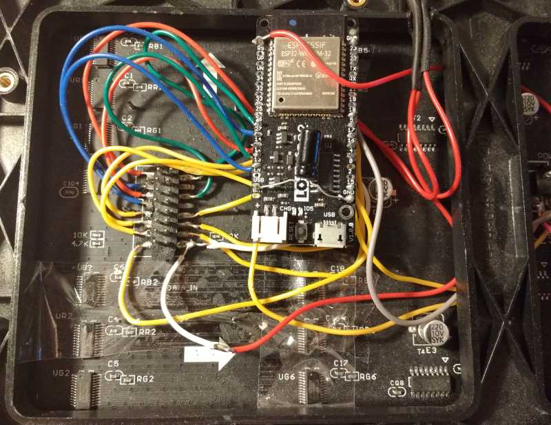

# Adafruit_GFX RGB64x32MatrixPanel library for the ESP32, utilising I2S DMA.

This ESP32 Arduino library for an RGB LED (HUB 75 type) Matrix Panel, utilises the DMA functionality provided by the ESP32's I2S 'LCD Mode' which basically means that pixel data can be sent straight from memory, via the DMA controller, to the relevant LED Matrix GPIO pins with little CPU overhead.

As a result, this library can theoretically provide ~20 bit colour, at various brightness levels without resulting in noticeable flicker.


# Installation

* Dependency: You will need to install [Adafruit_GFX_Library](https://github.com/adafruit/Adafruit-GFX-Library) from the "Library > Manage Libraries" menu.
* Download and unzip this repository into your Arduino/libraries folder (or better still, use the Arudino 'add library from .zip' option.
* Library also test to work fine with PlatformIO, install into your PlatformIO projects' lib/ folder as appropriate.

# Wiring ESP32 with the LED Matrix Panel

By default the pin mapping is as follows (defaults defined in ESP32-RGB64x32MatrixPanel-I2S-DMA.h).

```
 HUB 75 PANEL              ESP 32 PIN
+-----------+   
|  R1   G1  |    R1  -> IO25      G1  -> IO26
|  B1   GND |    B1  -> IO27
|  R2   G2  |    R2  -> IO14      G2  -> IO12
|  B2   GND |    B2  -> IO13
|   A   B   |    A   -> IO23      B   -> IO19
|   C   D   |    C   -> IO 5      D   -> IO17
| CLK   LAT |    CLK -> IO16      LAT -> IO 4
|  OE   GND |    OE  -> IO15      GND -> ESP32 GND
+-----------+
```


However, if you want to change this, simply provide the wanted pin mapping as part of the display.begin() call. For example, in your sketch have something like the following:

```
// Change these to whatever suits
#define R1_PIN  25
#define G1_PIN  26
#define B1_PIN  27
#define R2_PIN  14
#define G2_PIN  12
#define B2_PIN  13

#define A_PIN   23
#define B_PIN   22 
#define C_PIN   5
#define D_PIN   17
#define E_PIN   -1
          
#define LAT_PIN 4
#define OE_PIN  15

#define CLK_PIN 16


display.begin(R1_PIN, G1_PIN, B1_PIN, R2_PIN, G2_PIN, B2_PIN, A_PIN, B_PIN, C_PIN, D_PIN, E_PIN, LAT_PIN, OE_PIN, CLK_PIN );  // setup the LED matrix
```


The panel must be powered by 5V AC adapter with enough current capacity. (Current varies due to how many LED are turned on at the same time. To drive all the LEDs, you need 5V4A adapter.)


A [typical RGB panel available for purchase](https://www.aliexpress.com/item/256-128mm-64-32-pixels-1-16-Scan-Indoor-3in1-SMD2121-RGB-full-color-P4-led/32810362851.html). This is of the larger P4 (4mm spacing between pixels) type. 

# Usage

Refer to the excellent PxMatrix based library for how to wire one of these panels up (in fact, it's probably best to first get your panel working with this library first to be sure): https://github.com/2dom/PxMatrix

You'll need to adjust the pin configuration in this library of course.

## Can I chain displays?
This library has only been tested with a 64 pixel (wide) and 32 (high) RGB panel.  Theoretically, if you want to chain two of these horizontally to make a 128x32 panel you can do so with the cable and then set the MATRIX_WIDTH to '128'.

All of this is memory permitting of course (dependant on your sketch etc.) ... An ESP32 only has about 100kB of usable DMA memory, so you will have trouble dispalying any more than 32 (height) x 128 (width) pixels.

# Ghosting

If you experience ghosting, you will need to reduce the brightness level, not all RGB Matrix Panels are the same - some seem to display ghosting artefacts at lower brightness levels. In the setup() function do something like:

```
void setup() {
    Serial.begin(115200);
    matrix.setPanelBrightness(16); // SETS THE BRIGHTNESS HERE. 60 OR LOWER IDEAL.
    matrix.begin(R1_PIN, G1_PIN, B1_PIN, R2_PIN, G2_PIN, B2_PIN, A_PIN, B_PIN, C_PIN, D_PIN, E_PIN, LAT_PIN, OE_PIN, CLK_PIN );  // setup the LED matrix

}


```

The value to pass 'setPanelBrightness' is the RGB Matrix's pixel width or less. i.e. 64 or lower. However values greater than 60 can cause ghosting it seems on some panels. YMMV.

## Credits

* 'SmartMatrix' project code: https://github.com/pixelmatix/SmartMatrix/tree/teensylc

* Sprite_TM's demo implementation here: https://www.esp32.com/viewtopic.php?f=17&t=3188

