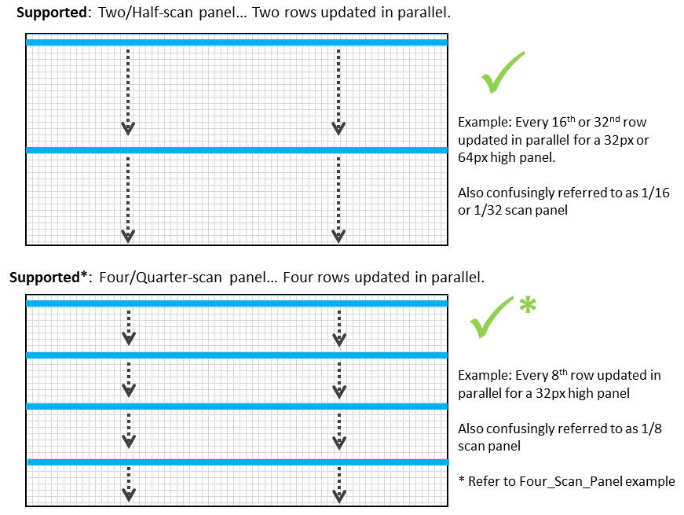
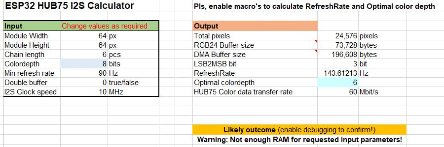
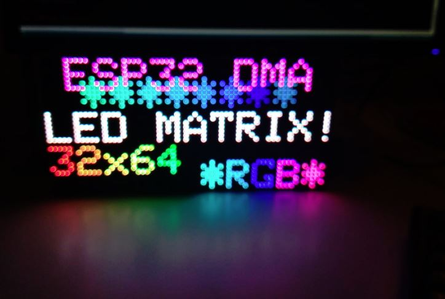

# HUB75 RGB LED Matrix Panel Library Using ESP32 DMA

__[BUILD OPTIONS](/doc/BuildOptions.md) | [EXAMPLES](/examples/README.md)__ | []([https://github.com/mrcodetastic/ESP32-HUB75-MatrixPanel-DMA/actions](https://github.com/mrcodetastic/ESP32-HUB75-MatrixPanel-DMA/actions))

## Table of Contents

- [Introduction](#introduction)
  * [Features](#features)
- [Hardware Compatibility](#hardware-compatibility)
  * [Supported ESP32 Variants](#supported-esp32-variants)
  * [Quick introduction to LED Matrix Panel 'Scan' types](#supported-panels)
  * [Tested Driver Chips](#tested-driver-chips)
  * [Unsupported Panels & Driver Chips](#unsupported-panels--driver-chips)
  * [Memory Requirements](#memory-requirements)
  * [Important Hardware Notes](#important-hardware-notes)
- [Getting Started](#getting-started)
  * [1. Library Installation](#1-library-installation)
  * [2. Wiring the ESP32 to an LED Matrix Panel](#2-wiring-the-esp32-to-an-led-matrix-panel)
  * [3. Running a Test Sketch](#3-running-a-test-sketch)
- [Usage & Configuration](#usage--configuration)
  * [Chaining Multiple Panels](#chaining-multiple-panels)
  * [Adjusting Panel Brightness](#adjusting-panel-brightness)
  * [Build-Time Options](#build-time-options)
  * [Latch Blanking](#latch-blanking)
  * [Clock Phase](#clock-phase)
  * [Power Requirements](#power-requirements)
- [Community & Acknowledgments](#community--acknowledgments)
  * [Inspiration](#inspiration)
  * [Projects Using This Library](#projects-using-this-library)
  * [Thanks & Acknowledgments](#thanks--acknowledgments)
  * [Support & Donations](#support--donations)
  * [Music](#music)

---

# Introduction

* An Arduino and ESP-IDF library for HUB75 and HUB75E RGB LED panels using the ESP32.
* Works out of the box with standard HUB75 panels where two rows are updated at the same time (referred to as "two scan" panels in this document).
* Also supports 1/4, 1/8 scan panels. For usage, please see the `VirtualMatrixPanel` example, or refer to instructions found in the various issues within this repository. 
* Uses the ESP32's hardware DMA ("LCD Mode") for high-speed output with low CPU usage.

## Features

- **Low CPU usage** — Pixel data streams directly using hardware DMA without using CPU resources.
- **Fast performance** — Fast bitwise operations on the DMA buffer avoid pin toggling or blocking calls.
- **Full-screen BCM** — Uses [binary-code modulation](http://www.batsocks.co.uk/readme/art_bcm_5.htm) across the entire matrix for smooth color depth and brightness.
- **Variable color depth** — Supports up to 24-bit TrueColor depending on panel size and refresh rate.
- **Natural dimming** — Includes [CIE 1931 luminance correction](https://ledshield.wordpress.com/2012/11/13/led-brightness-to-your-eye-gamma-correction-no/) for human eye brightness perception.
- **Adafruit GFX compatible** — Works with Adafruit GFX, a simplified GFX implementation, or standalone without any GFX library.

---

# Hardware Compatibility

> **Important Buying Advice:**
> Before buying an LED matrix panel, ask the seller to confirm that the panel is **NOT** an "S-PWM" chip and uses standard shift-register driver chips such as the FM6124.

New panel driver chips are released frequently. Always check with the seller before purchasing.

## Supported ESP32 Variants

* **ESP32** (Original module, such as ESP-WROOM-32 with ESP32-D0WDQ6 chip)
* **ESP32-S2**
* **ESP32-S3**

*Note: RISC-V ESP32 variants (such as the ESP32-C3) are not supported because they lack the required hardware LCD mode.*

## A quick introduction to LED Matrix Panel 'Scan' types

* **"Two scan" panels** (two rows updated in parallel):
  * 64x32 indoor panels (1/16 scan rate).
  * 64x64 indoor panels (1/32 scan rate).

* **"Four scan" panels** (four rows updated in parallel):
  * 32x16 indoor panels (1/4 scan rate) using the method shown in the `Four_Scan_Panel` example.
  * 128x64 panels with the [SM5266P](https://github.com/mrfaptastic/ESP32-HUB75-MatrixPanel-I2S-DMA/issues/164) chip.
  * 80x40 panels (1/10 scan rate) with 8-pixel column reversal. See [80x40 4-scan (ZIGZAG8)](/doc/Panel_80x40_4Scan_ZigZag8.md).

For technical background on matrix panel hardware, read [this SparkFun article](https://www.sparkfun.com/news/2650).



## Tested Driver Chips

The following driver chips work well with this library:
* ICND2012
* [RUC7258](http://www.ruichips.com/en/products.html?cateid=17496)
* FM6126A, ICN2038S, [FM6124](https://datasheet4u.com/datasheet-pdf/FINEMADELECTRONICS/FM6124/pdf.php?id=1309677) (See the [PatternPlasma](/examples/2_PatternPlasma) example)
* SM5266P
* DP3246 with SM5368 row registers

## Unsupported Panels & Driver Chips

The following panels and driver chips are known to be **NOT supported** (there are likely many more):
* **S-PWM or PWM panels** chipset based panels (e.g., RUL6024, MBI6024, HX6158SP, MBI5051, MBI5052, MBI5053, ICND2055CP). These panels work completely different are essentially their own framebuffers + PWM on chip, which is incompatible with this library.
* [SM1620B](https://github.com/mrfaptastic/ESP32-HUB75-MatrixPanel-DMA/issues/416)
* Panels using RUL5358 or SHIFTREG_ABC_BIN_DE.
* Panels using ICN2053 or FM6353. Use [this library fork](https://github.com/LAutour/ESP32-HUB75-MatrixPanel-DMA-ICN2053) instead (see [discussion](https://github.com/mrfaptastic/ESP32-HUB75-MatrixPanel-DMA/discussions/324)).

If your panel is not supported, consider using the [PxMatrix library](https://github.com/2dom/PxMatrix).

## Memory Requirements

DMA buffers use the microcontroller's internal SRAM memory. Check the [Memory Calculator](/doc/memcalc.md) to calculate expected SRAM usage.



* **ESP32-S3:** You can store the DMA buffer in external PSRAM **only if using Octal SPI PSRAM** (e.g., ESP32-S3-N8R8). Max output frequency is limited to ~13 MHz to avoid image flickering. Do not use Quad-SPI (Q-SPI) PSRAM because it is too slow. See [Build Options](/doc/BuildOptions.md) to enable PSRAM.
* **Standard ESP32 & ESP32-S2:** You must use **internal SRAM**. You are limited to available internal RAM (~200 KB free memory), regardless of attached external PSRAM.

## Important Hardware Notes

* High-frequency DMA signals may cause Wi-Fi interference on some board designs.
* The **Adafruit MatrixPortal S3** can experience Wi-Fi radio issues with this library. It is not recommended if you need Wi-Fi. See [discussion](https://github.com/mrcodetastic/ESP32-HUB75-MatrixPanel-DMA/discussions/258#discussioncomment-12274566).

---

# Getting Started

## 1. Library Installation

1. Open Arduino IDE, go to **Library Manager**, and install **Adafruit_GFX**.
2. Search for and install this library from the Library Manager.

**PlatformIO:** Add the library to the `lib/` folder or add it to `lib_deps` inside `platformio.ini`. See [Build Options](/doc/BuildOptions.md) and [PlatformIO lib_deps](https://docs.platformio.org/en/latest/projectconf/section_env_library.html#lib-deps).

## 2. Wiring the ESP32 to an LED Matrix Panel

Check default pin maps in `default-pins.hpp` under the [platforms folder](https://github.com/mrfaptastic/ESP32-HUB75-MatrixPanel-DMA/tree/master/src/platforms).

You can customize pin assignments in code:

```cpp
// Change these pins as needed
#define R1_PIN 25
#define G1_PIN 26
#define B1_PIN 27
#define R2_PIN 14
#define G2_PIN 12
#define B2_PIN 13
#define A_PIN 23
#define B_PIN 19
#define C_PIN 5
#define D_PIN 17
#define E_PIN -1 // Required for 1/32 scan panels (e.g., 64x64px). Use any open pin, e.g., IO32
#define LAT_PIN 4
#define OE_PIN 15
#define CLK_PIN 16

HUB75_I2S_CFG::i2s_pins _pins={R1_PIN, G1_PIN, B1_PIN, R2_PIN, G2_PIN, B2_PIN, A_PIN, B_PIN, C_PIN, D_PIN, E_PIN, LAT_PIN, OE_PIN, CLK_PIN};
HUB75_I2S_CFG mxconfig(
	64, // Module width
	32, // Module height
	2, // Chain length
	_pins // Pin mapping
);
dma_display = new MatrixPanel_I2S_DMA(mxconfig);
```

> **Grounding:** Connect at least one Ground (GND) pin on the HUB75 connector to an ESP32 GND pin to prevent visual artifacts.

### Using Adapter Boards & Shields

Custom adapter PCBs make wiring easier:
* Brian Lough's [ESP32 I2S Matrix Shield](https://github.com/rorosaurus/esp32-hub75-driver)
* Charles Hallard's [WeMos Matrix Shield](https://github.com/hallard/WeMos-Matrix-Shield-DMA)
* Bogdan Sass's [Morph Clock Shield](https://github.com/mrfaptastic/ESP32-HUB75-MatrixPanel-I2S-DMA/discussions/110#discussioncomment-861152)
* [Matouch 1.28" ToolSet RGB LED Matrix](https://www.makerfabs.com/matouch-1-28-toolset-rgb-led-matrix.html)

### Configuring Off-the-Shelf Boards (e.g., Adafruit MatrixPortal)

Find your board's pin numbers in the Adafruit Protomatter examples (e.g., [doublebuffer_scrolltext.ino](https://github.com/adafruit/Adafruit_Protomatter/blob/master/examples/doublebuffer_scrolltext/doublebuffer_scrolltext.ino)) and update your `#define` values.

**Example for MatrixPortal S3:**

Protomatter definition:
```cpp
uint8_t rgbPins[]  = {42, 41, 40, 38, 39, 37};
uint8_t addrPins[] = {45, 36, 48, 35, 21};
uint8_t clockPin   = 2;
uint8_t latchPin   = 47;
uint8_t oePin      = 14;
```

Library config:
```cpp
#define R1_PIN 42
#define G1_PIN 41
#define B1_PIN 40
#define R2_PIN 38
#define G2_PIN 39
#define B2_PIN 37
#define A_PIN  45
#define B_PIN  36
#define C_PIN  48
#define D_PIN  35
#define E_PIN  21 
#define LAT_PIN 47
#define OE_PIN  14
#define CLK_PIN 2

HUB75_I2S_CFG::i2s_pins _pins={R1_PIN, G1_PIN, B1_PIN, R2_PIN, G2_PIN, B2_PIN, A_PIN, B_PIN, C_PIN, D_PIN, E_PIN, LAT_PIN, OE_PIN, CLK_PIN};

HUB75_I2S_CFG mxconfig(
  PANEL_RES_X,   // Module width
  PANEL_RES_Y,   // Module height
  PANEL_CHAIN,   // Chain length
  _pins          // Pin mapping
);
```

### Using 64x64 Square Panels (HUB75E)

For 64x64 panels (HUB75E), you **must** assign a valid `E_PIN` and connect it to the E pin on the panel header.

## 3. Running a Test Sketch

Call `begin()` before drawing shapes, lines, or text.

Minimal example:
```cpp
void setup() {
    dma_display->begin();
    dma_display->drawPixel(0, 0, dma_display->color565(255, 255, 255)); // Draw a white dot at top-left
}

void loop() {}
```

After verifying basic operation, test with the [PIO Test Patterns](/examples/PIO_TestPatterns) example. This sketch displays test patterns to help identify flickering, ghosting, or pin mapping issues.

---

# Usage & Configuration

## Chaining Multiple Panels

Yes, panels can be connected together in sequence using HUB75 ribbon cables.

* **Horizontal Chaining:** Connect panels end-to-end (e.g., two 64x32 panels for a 128x32 display). Update the chain length setting in `mxconfig`. See [Pattern Plasma](/examples/2_PatternPlasma/).
* **Grid Layouts:** To chain four 64x32 panels into a 2x2 grid (128x64 display), see the [VirtualMatrixPanel](/examples/VirtualMatrixPanel/) and [AuroraDemo](/examples/AuroraDemo/) examples.

Resolutions above 128x64 may cause memory errors due to ESP32 internal SRAM limits.


## Adjusting Panel Brightness

Default brightness is set to 128 (50%). Change brightness using `setPanelBrightness(val)` or `setBrightness8(val)`.

* Value range: `0` (off) to `255` (full brightness).

Example:
```cpp
void setup() {
    Serial.begin(115200);
    dma_display->begin();
    dma_display->setBrightness8(192); // Set brightness (~75%)
    dma_display->clearScreen();	
}
```


## Build-Time Options

For IDEs supporting compile-time flags (such as [PlatformIO](https://platformio.org/) or [Eclipse](https://www.eclipse.org/ide/)), view the [Build Options Document](/doc/BuildOptions.md).

## Latch Blanking

If pixels repeat horizontally (ghosting), adjust Latch Blanking using `setLatBlanking(uint8_t v)`.

Latch blanking disables display output via OE during LAT pin transitions to hide row switching artifacts.

* Range: `1` to `4` (default is `1`). Higher values reduce overall display brightness.

Example:
```cpp
dma_display->setLatBlanking(2);
```

## Clock Phase

If pixels appear shifted by 1 pixel or show ghosting, change the clock edge mode. Some panels update on the rising clock edge; others update on the falling clock edge.

Default behavior is positive clock edge. To switch to negative clock edge, set:
```cpp
mxconfig.clkphase = false;
```
See the [Simple Test Shapes Example](https://github.com/mrcodetastic/ESP32-HUB75-MatrixPanel-DMA/blob/a5d6611b65c365a252e6787e0afc267cf63c1996/examples/1_SimpleTestShapes/1_SimpleTestShapes.ino#L98).

## Power Requirements

A stable power supply is **critical**:
1. Solder a 1000 µF–2000 µF capacitor across the **VCC and GND pins** on the back of each panel to stabilize power spikes.
2. ESP32 outputs 3.3V signals. Some panels require 5V logic inputs. Use level shifters if panel inputs do not recognize 3.3V signals reliably.

Useful resources:
* [Raspberry Pi Matrix Power Guide](https://github.com/hzeller/rpi-rgb-led-matrix/blob/master/wiring.md#a-word-about-power)
* [Power Supply Issue Discussion](https://github.com/mrfaptastic/ESP32-HUB75-MatrixPanel-I2S-DMA/issues/39#issuecomment-722691127)
* [3.3V Logic Level Discussion](https://github.com/mrfaptastic/ESP32-HUB75-MatrixPanel-I2S-DMA/issues/35#issuecomment-726419862)

---

# Community & Acknowledgments

## Inspiration

This project was inspired by:
* [SmartMatrix](https://github.com/pixelmatix/SmartMatrix/tree/teensylc)
* [Sprite_TM's ESP32 Demo](https://www.esp32.com/viewtopic.php?f=17&t=3188)

## Projects Using This Library

* [128x64 Morph Clock](https://github.com/bogd/esp32-morphing-clock)
* [FFT Audio Visualization](https://github.com/mrfaptastic/ESP32-HUB75-MatrixPanel-I2S-DMA/discussions/149)
* [Clock, GIF Animator and Audio Visualizer](https://github.com/mrfaptastic/ESP32-HUB75-MatrixPanel-I2S-DMA/discussions/153)
* [Aurora Audio Visualizer](https://github.com/mrfaptastic/ESP32-HUB75-MatrixPanel-I2S-DMA/discussions/188)
* [Big Visualization](https://github.com/mrfaptastic/ESP32-HUB75-MatrixPanel-I2S-DMA/discussions/155)
* [Clockwise](https://jnthas.github.io/clockwise/)
* [ZeDMD](https://github.com/PPUC/ZeDMD)
* [MatrixCOS](https://github.com/mklossde/MatrixCOS)

## Thanks & Acknowledgments

* [Brian Lough](https://www.tindie.com/stores/brianlough/) ([YouTube](https://www.youtube.com/c/brianlough)) for code contributions, testing hardware, and suggestions.
* [Vortigont](https://github.com/vortigont) for performance optimizations and major code contributions.
* [Galaxy Man](https://github.com/Galaxy-Man) for donating 1/16 scan panels to help implement virtual display chaining.
* [Pipimaxi](https://github.com/Pipimaxi) for donating an ESP32-S2 module, and [Radu](https://github.com/juniorradu) for donating an ESP32-S3 module.
* [Mark Donners](https://github.com/donnersm) ([YouTube](https://www.youtube.com/watch?v=bQ7c9Vlhyp0&t=118s)) for donating a 1/8 scan panel.
* [PaintYourDragon](https://github.com/PaintYourDragon) for ESP32-S3 DMA logic.

## Support & Donations

This library is developed as a free open-source personal project. To support ongoing development or help fund hardware panel purchases, see [this discussion thread](https://github.com/mrfaptastic/ESP32-HUB75-MatrixPanel-DMA/discussions/349) or visit [mrcodetastic on GitHub](https://github.com/mrcodetastic/).

## Music

An AI-generated song about this library:
[Listen on Suno](https://suno.com/song/183aa807-9fb6-410c-b0e9-0ea945232950) 😊


