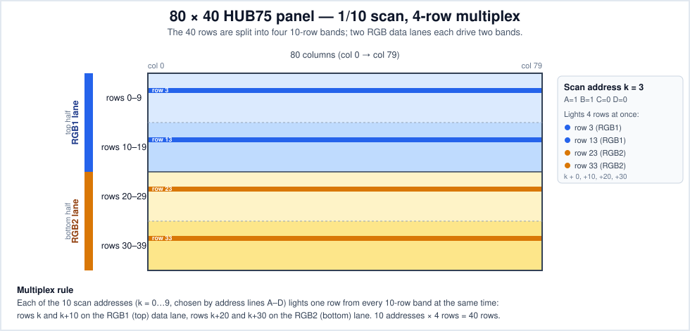
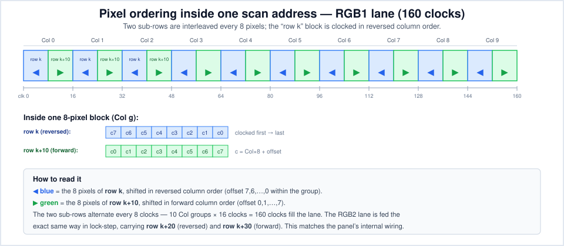

# 80×40 4-scan HUB75 panel (ZIGZAG8 / 8-pixel-segment reversal)

This documents a custom **80×40, 1/10-scan** HUB75 LED panel whose driver ICs
fold two logical rows into one 160-long shift register per colour lane and
mirror the column order inside every 8-LED block. Standard HUB75 scan types will
not drive it, so the library provides:

- scan type **`FOUR_SCAN_40_80PX_ZIGZAG8`** (`VirtualMatrixPanel_T`) — the
  coordinate remap described below;
- shift driver **`SM16208`** (`HUB75_I2S_CFG::driver`) — this panel's SM16208
  constant-current chips latch on the inverted shift clock, so selecting the
  driver sets `clkphase = false` for you.

All diagrams are SVG in this folder.

## Enabling it

```cpp
HUB75_I2S_CFG mxconfig(160, 20, 1);            // NOTE: 160×20, not 80×40 (see below)
mxconfig.driver = HUB75_I2S_CFG::SM16208;      // sets clkphase = false

auto *dma = new MatrixPanel_I2S_DMA(mxconfig);
dma->begin();

VirtualMatrixPanel_T<CHAIN_NONE, ScanTypeMapping<FOUR_SCAN_40_80PX_ZIGZAG8>, 1>
    panel(1, 1, 80, 40);
panel.setDisplay(*dma);
panel.drawPixel(x, y, color);                  // logical 80×40 coordinates
```

> **Configure the DMA as 160×20, not 80×40.** The mapping targets a folded
> 160×20 surface; an 80×40 config silently drops every mapped `x ≥ 80` (the right
> half of every row) and never lights the second RGB lane (rows 20–39 stay dark).

---

## The panel at a glance

| Property              | Value                                                     | Notes                              |
| --------------------- | --------------------------------------------------------- | ---------------------------------- |
| Resolution            | **80 × 40** pixels                                        | logical addressable area           |
| Scan rate             | **1/10** (10 address values cycled per frame)             | `A…D` select 1 of 10 addresses     |
| Rows lit per address  | **4** (a "4-scan" panel)                                  | `k`, `k+10`, `k+20`, `k+30`        |
| Address lines         | **A, B, C, D** (no E)                                     | 4 bits cover the 10 addresses      |
| Data lanes            | **2** — RGB1 (top half) + RGB2 (bottom half)              | `R1/G1/B1` and `R2/G2/B2`          |
| Shift chain per lane  | **160 clocks** = 80 cols × 2 sub-rows                     | 10 groups × (8 + 8)                |
| Quirk                 | **8-pixel-segment column reversal**, asymmetric per phase | offsets 7→0 vs 0→7                  |

This is a common "outdoor module" arrangement: a physically 80×40 panel whose
driver ICs fold **two logical rows into one 160-long shift register per colour
lane**, and mirror the column order inside every 8-LED block. None of this is
standard 1/16-scan HUB75, which is why the pixel order has to be remapped — the
job of the `FOUR_SCAN_40_80PX_ZIGZAG8` mapping (see *Pixel ordering* below).

---

## Panel organization

The 40 rows split into four contiguous 10-row **bands**. Two RGB data lanes each
own two bands; the four bands are addressed together, one row each, by the same
scan address `k`.



**Multiplex rule.** For scan address `k` (0…9, set on A–D):

- **RGB1 lane** (top half) shows **row `k`** and **row `k+10`**.
- **RGB2 lane** (bottom half) shows **row `k+20`** and **row `k+30`**.

Four physical rows are lit at once; ten addresses cover all 40 rows. Within a
lane the two rows are distinguished not by address but by *where in the 160-clock
shift they land* (see *Pixel ordering* below).

---

## Pixel ordering inside one scan address

This is the heart of the panel. Each 160-clock lane is **not** "row `k` then row
`k+10`" in two 80-pixel halves. Instead the two sub-rows are **interleaved every
8 pixels**, and the `k` block is clocked in **reversed** column order:



For each of the 10 column groups (`Col` = 0…9), the panel expects the two
multiplexed sub-rows clocked in two back-to-back 8-clock phases — one reversed,
one forward. So within one 8-pixel group the chain carries `row k` reversed
(offsets 7→0), then `row k+10` forward (offsets 0→7) — 16 clocks — repeated for
10 groups = 160 clocks. RGB2 rides the same clocks carrying `k+20` / `k+30`.

The reversal is asymmetric (one sub-row reversed, the other forward) because the
panel wires its two multiplexed sub-rows in mirror-image order inside each 8-LED
module; compensating in software makes both scan left-to-right on screen. This is
exactly the transform implemented by `FOUR_SCAN_40_80PX_ZIGZAG8` in
[`src/ESP32-HUB75-VirtualMatrixPanel_T.hpp`](../src/ESP32-HUB75-VirtualMatrixPanel_T.hpp).
