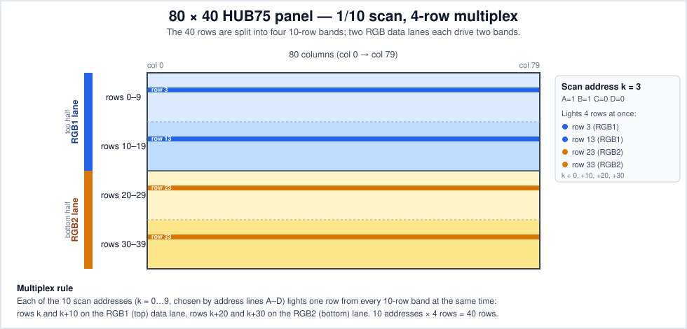
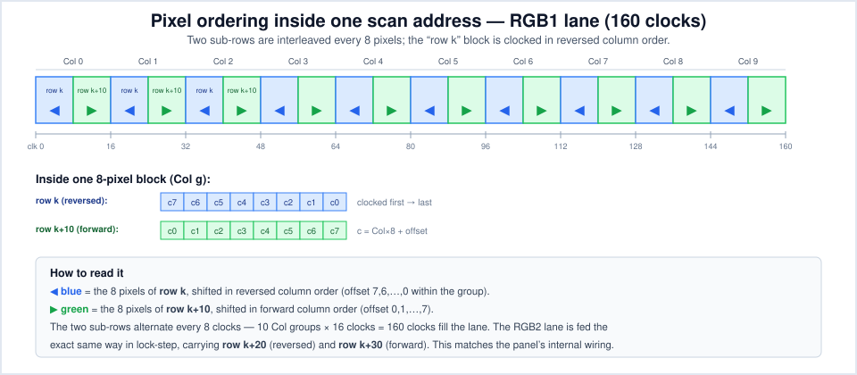
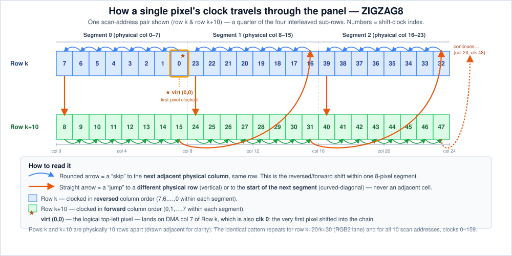

# 80×40 4-scan HUB75 panel (ZIGZAG8 / 8-pixel-segment reversal)

This documents a custom **80×40, 1/10-scan** HUB75 LED panel whose driver ICs fold two logical rows into one 160-long shift register per color lane and
mirror the column order inside every 8-LED block. To drive this panel, we need to create custom scan-type and pass it to `VirtualMatrixPanel_T`:

```cpp
template <PANEL_CHAIN_TYPE ChainScanType,
          class ScanTypeMapping = ScanTypeMapping<STANDARD_TWO_SCAN>,
          int ScaleFactor = 1>
class VirtualMatrixPanel_T { ... };
```

Internally the class only ever calls `ScanTypeMapping::apply(coords, panel_pixel_base)` (unqualified). That's a duck-typed policy slot — any type
with a matching static `apply()` works, including one defined entirely in user sketch code. `panel_pixel_base` and `setPixelBase()` are pre-existing members of `VirtualMatrixPanel_T`.

This panel's SM16208 constant-current driver ICs latch data on the inverted shift clock. There's no dedicated `SM16208` driver entry, so set `mxconfig.clkphase = false;` directly — the same effect the `MBI5124` case gets from selecting that driver.

## Full example: 80×40 ZIGZAG8 panel

```cpp
#include <ESP32-HUB75-MatrixPanel-I2S-DMA.h>
#include <ESP32-HUB75-VirtualMatrixPanel_T.hpp>

// ---------------------------------------------------------------------
// Custom scan-type policy for this panel's SM16208 driver ICs.
// Same interface the library's built-in ScanTypeMapping<T> uses, so it
// can be passed directly as VirtualMatrixPanel_T's ScanType template
// argument.
// ---------------------------------------------------------------------
struct SM16208ZigZagMapping {
  static VirtualCoords apply(VirtualCoords coords, int panel_pixel_base) {
    int row_group  = coords.y / 10;                // 0..3
    int col_group  = coords.x / panel_pixel_base;   // segment index
    int col_within = coords.x % panel_pixel_base;   // offset within segment

    if (row_group % 2 == 0) {
      coords.x = col_group * (panel_pixel_base * 2) + (panel_pixel_base - 1 - col_within);  // reversed phase
    } else {
      coords.x = col_group * (panel_pixel_base * 2) + panel_pixel_base + col_within;         // forward phase
    }

    // Fold 40 logical rows into 20 DMA rows (RGB1: 0-9, RGB2: 10-19).
    coords.y = (coords.y / 20) * 10 + (coords.y % 10);
    return coords;
  }
};

// ---------------------------------------------------------------------
// Panel configuration
// ---------------------------------------------------------------------
#define PANEL_RES_X 80   // logical panel width
#define PANEL_RES_Y 40   // logical panel height

MatrixPanel_I2S_DMA *dma_display = nullptr;
VirtualMatrixPanel_T<CHAIN_NONE, SM16208ZigZagMapping, 1> *panel = nullptr;

void setup() {
  Serial.begin(115200);

  // NOTE: 160x20, not 80x40 - the mapping targets a folded 160x20 DMA
  // surface. An 80x40 config silently drops every mapped x >= 80 and
  // never lights the second RGB lane (rows 20-39 stay dark).
  HUB75_I2S_CFG mxconfig(160, 20, 1);
  mxconfig.clkphase = false;   // SM16208 latches on the inverted shift clock

  dma_display = new MatrixPanel_I2S_DMA(mxconfig);
  dma_display->begin();
  dma_display->setBrightness8(90); // 0-255
  dma_display->clearScreen();

  panel = new VirtualMatrixPanel_T<CHAIN_NONE, SM16208ZigZagMapping, 1>(
      1, 1, PANEL_RES_X, PANEL_RES_Y);
  panel->setDisplay(*dma_display);
  panel->setPixelBase(8);   // this panel's segment width
}

void loop() {
  // Fill the panel pixel by pixel to verify the mapping - logical
  // 80x40 coordinates, red.
  for (int y = 0; y < panel->height(); y++) {
    for (int x = 0; x < panel->width(); x++) {
      panel->drawPixel(x, y, panel->color565(255, 0, 0));
      delay(5);
    }
  }
  delay(1000);
  dma_display->clearScreen();
}
```

> **Configure the DMA as 160×20, not 80×40.** The mapping targets a folded 160×20 surface; an 80×40 config silently drops every mapped `x ≥ 80` (the right half of every row) and never lights the second RGB lane (rows 20–39 stay dark).

> **Call `setPixelBase(8)` before drawing.**  The 8-pixel segment size is a property of this panel's driver ICs, not the scan type, so it isn't set for you. The default pixel base (panel width, 80) is wrong here and will scramble the image.

---

## The panel at a glance

| Property              | Value                                                     | Notes                              |
| --------------------- | --------------------------------------------------------- | ---------------------------------- |
| Resolution            | **80 × 40** pixels                                        | logical addressable area           |
| Scan rate             | **1/10** (10 address values cycled per frame)             | `A…D` select 1 of 10 addresses     |
| Rows lit per address  | **4** (a "4-scan" panel)                                  | `k`, `k+10`, `k+20`, `k+30`        |
| Address lines         | **A, B, C, D** (no E)                                     | 4 bits cover the 10 addresses      |
| Data lanes            | **2** — RGB1 (top half) + RGB2 (bottom half)              | `R1/G1/B1` and `R2/G2/B2`          |
| Shift chain per lane  | **160 clocks** = 80 cols × 2 sub-rows                     | 10 groups × (8 + 8)                |
| Quirk                 | **8-pixel-segment column reversal**, asymmetric per phase | offsets 7→0 vs 0→7                  |

This is a common "outdoor module" arrangement: a physically 80×40 panel whose driver ICs fold **two logical rows into one 160-long shift register per colour lane**, and mirror the column order inside every 8-LED block. None of this is standard 1/16-scan HUB75, which is why the pixel order has to be remapped.

---

## Panel organization

The 40 rows split into four contiguous 10-row **bands**. Two RGB data lanes each own two bands; the four bands are addressed together, one row each, by the same scan address `k`.



**Multiplex rule.** For scan address `k` (0…9, set on A–D):

- **RGB1 lane** (top half) shows **row `k`** and **row `k+10`**.
- **RGB2 lane** (bottom half) shows **row `k+20`** and **row `k+30`**.

Four physical rows are lit at once; ten addresses cover all 40 rows. Within a lane the two rows are distinguished not by address but by *where in the 160-clock shift they land* (see *Pixel ordering* below).

---

## Pixel ordering inside one scan address

This is the heart of the panel. Each 160-clock lane is **not** "row `k` then row `k+10`" in two 80-pixel halves. Instead the two sub-rows are **interleaved every 8 pixels**, and the `k` block is clocked in **reversed** column order:



For each of the 10 column groups (`Col` = 0…9), the panel expects the two multiplexed sub-rows clocked in two back-to-back 8-clock phases — one reversed, one forward. So within one 8-pixel group the chain carries `row k` reversed (offsets 7→0), then `row k+10` forward (offsets 0→7) — 16 clocks — repeated for 10 groups = 160 clocks. RGB2 rides the same clocks carrying `k+20` / `k+30`.

The reversal is asymmetric (one sub-row reversed, the other forward) because the panel wires its two multiplexed sub-rows in mirror-image order inside each 8-LED module; compensating in software makes both scan left-to-right on screen. This is exactly the transform implemented by the custom scan-type.

### Tracing a single pixel's path

The diagram below walks the same 16-clock, one-segment-at-a-time pattern described above, but cell by cell — one scan-address pair (row `k` / row
`k+10`, a quarter of the four interleaved sub-rows), three 8-pixel segments:



Rounded arrows are the "skip" to the next adjacent physical column within a segment (reversed on row `k`, forward on row `k+10`); straight arrows are the
"jump" to a different physical row or into the next segment — never an adjacent cell. The clock numbers in each cell confirm the order matches the
zigzag described above. The gold-outlined cell marks `panel.drawPixel(0, 0, ...)` — logical (0,0) lands on DMA col 7 of row `k`, which is also clock 0:
the very first pixel shifted into the chain.
