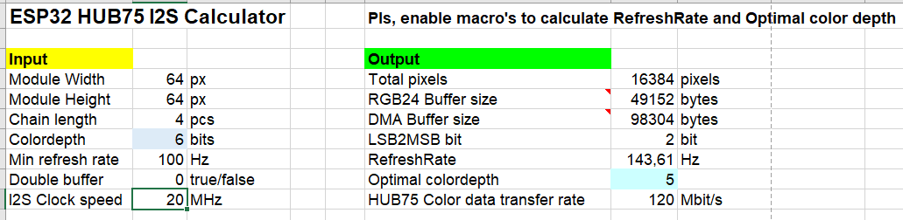

### I2S HUB75 Calculator

I've made this [spreadsheet](i2s_memcalc.xlsm) to estimate all of the main parameters for ESP32-HUB75-MatrixPanel-I2S-DMA lib driving any combination of matrixes/chains so that I do not need to reflash it hundreds of times just to check for the debug info about memory.
Be sure to enable embeded macro's to allow refresh rate calculations.

Just fill-in all of the INPUT fields and get the OUTPUTs.

So there are  two main resources used to drive LED matrix
 - Memory
 - I2S clock speed (resulting in available bandwidth to pump pixel color data)

And there are lot's of hogs for those:
 - matrix resolution (number of pixels)
 - number of modules in chain
 - pixel color depth
 - [BCM](http://www.batsocks.co.uk/readme/art_bcm_5.htm) LSB to MSB transition
 - double buffering

Equalising ones with the others results in **Refresh rate**,

or (rough approximation) 

[//]: # (github markdown does not like LaTex formulas)
[//]: # ($$RefreshRate=\frac{resolution \times chain \times (ColorDepth-LSB2MSB)}{ I ^2S _ {clock} }$$)

So, how to find optimum balance for all of these? Obviously you can't change *resolution* and *chain length*, it is physical characteristics and there is not much you can do about it except cutting of your chain or pushing it to the memory limits.

There are 3 parameters you can choose from (actually two:)
 - **Color Depth** - predefined at [build-time]((/doc/BuildOptions.md)) option

 -   I2S clock speed - run-time tunable with a very limited options

- **LSB-to-MSB** transition - it can't  be controlled in any way, library uses it internaly trying to balance all of the above 

Using provided table it is possible to estimate all of the parameters before running the library. Besides calculating memory requirements it could help to find **optimum color depth** for your matrix configuration. For higher resolutions default 8 bits could be too much to sustain minimal refresh rate and avoid annoying flickering. So the library would increase MSB transition to keep the balance, thus reducing dynamic range in shadows and dark colors. As a result it is nearly almost the same as just reducing overal color depth. **But** reducing global color depth would also saves lot's of precious RAM!
Now it's all up to you to decide :)

/Vortigont/