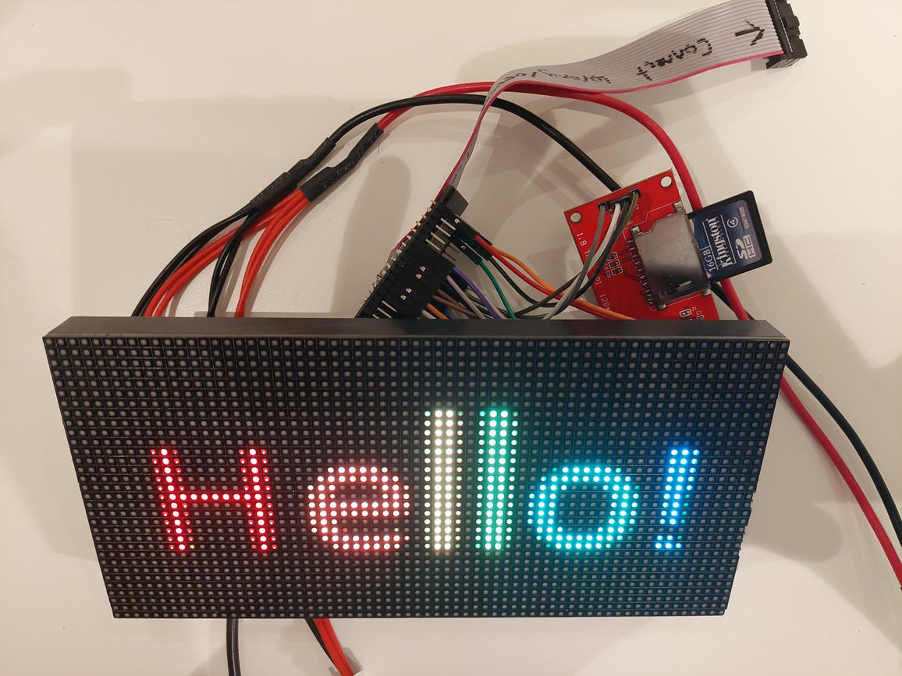

# ESP32-HUB75-MatrixPanel-DMA SDCard example

A very basic example using the 'Animated GIF' library by Larry Bank + the SD / File system library provided for Arduino by Espressif.

Some default HUB75 pins need to be remapped to accomodate for the SD Card.

## How to use it?

1. Format a SD Card with FAT32 file system (default setting)
2. Create a directory called 'gifs'
3. Drop your gifs in there. The resolution of the GIFS must match that of the display.

