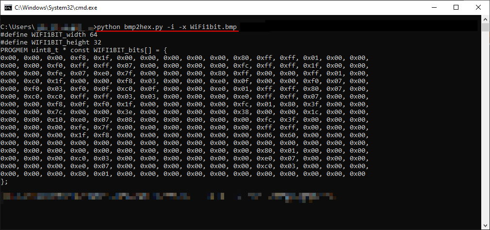

# Xbm Bitmap example
## Requirements
* To generate the required Xbm data to be copied into the Sketch. Have python and paint.net installed.
* Bitmap should match the resolution of your display configuration.

## Instructions 
 * 1. SAVE BITMAP AS 1BIT COLOUR in paint.net 
 * 2. Run: bmp2hex.py -i -x loading.bmp
 * 3. Copy paste output into sketch.
 
 
 
 