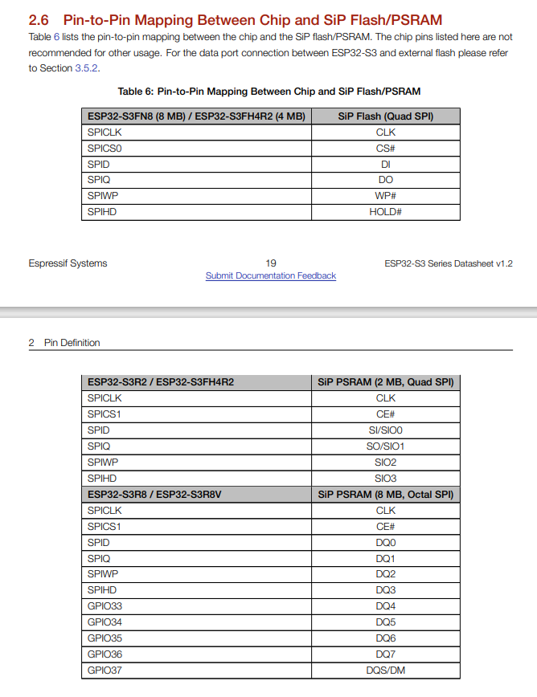

https://docs.espressif.com/projects/esp-idf/en/latest/esp32s3/api-guides/external-ram.html

Restrictions

External RAM use has the following restrictions:

When flash cache is disabled (for example, if the flash is being written to), the external RAM also becomes inaccessible; any reads from or writes to it will lead to an illegal cache access exception. This is also the reason why ESP-IDF does not by default allocate any task stacks in external RAM (see below).

	External RAM cannot be used as a place to store DMA transaction descriptors or as a buffer for a DMA transfer to read from or write into. Therefore when External RAM is enabled, any buffer that will be used in combination with DMA must be allocated using heap_caps_malloc(size, MALLOC_CAP_DMA | MALLOC_CAP_INTERNAL) and can be freed using a standard free() call.

*Note, although ESP32-S3 has hardware support for DMA to/from external RAM, this is not yet supported in ESP-IDF.*

External RAM uses the same cache region as the external flash. This means that frequently accessed variables in external RAM can be read and modified almost as quickly as in internal ram. However, when accessing large chunks of data (>32 KB), the cache can be insufficient, and speeds will fall back to the access speed of the external RAM. Moreover, accessing large chunks of data can “push out” cached flash, possibly making the execution of code slower afterwards.

In general, external RAM will not be used as task stack memory. xTaskCreate() and similar functions will always allocate internal memory for stack and task TCBs.

Reserved Pins on ESP32-S3:

Devkit Layout:

